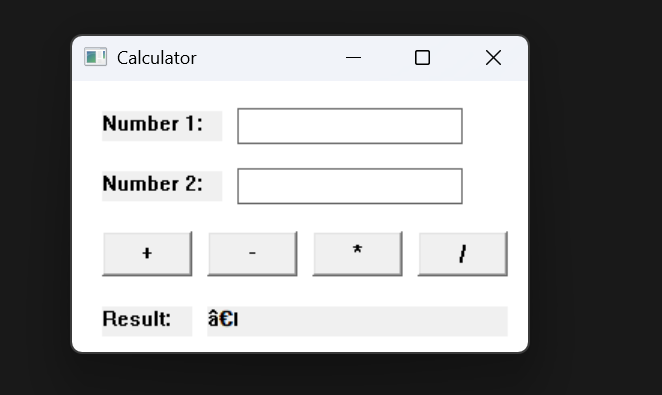

# 🧮 Win32 Calculator

A lightweight desktop calculator application built with pure C and the Windows API (Win32). No external libraries or frameworks — just raw WinAPI.

---

## 📸 Preview



---

## ✨ Features

- Addition, subtraction, multiplication, and division
- Division-by-zero error handling
- Minimal native Win32 UI — no dependencies
- Lightweight single-file source

---

## 🛠️ Requirements

- Windows OS
- A C compiler targeting Win32:
  - [MinGW-w64](https://www.mingw-w64.org/) (GCC for Windows), **or**
  - MSVC (Visual Studio)

---

## 🚀 Getting Started

### Clone the repo

```bash
git clone https://github.com/your-username/win32-calculator.git
cd win32-calculator
```

### Compile with MinGW (GCC)

```bash
gcc calculator.c -o calculator.exe -mwindows
```

> The `-mwindows` flag links against the Win32 subsystem and suppresses the console window.

### Compile with MSVC

```bash
cl calculator.c /link user32.lib
```

### Run

```bash
./calculator.exe
```

Or just double-click `calculator.exe` in File Explorer.

---

## 📁 Project Structure

```
win32-calculator/
├── calculator.c   # Full source — UI, logic, and WinMain entry point
└── README.md
```

---

## 🔧 How It Works

| Component | Description |
|---|---|
| `WinMain` | Entry point; registers the window class and starts the message loop |
| `WndProc` | Window procedure handling `WM_CREATE`, `WM_COMMAND`, and `WM_DESTROY` |
| `WM_CREATE` | Creates all child controls (labels, input fields, buttons) |
| `WM_COMMAND` | Dispatches button clicks to `calculate()` |
| `calculate()` | Reads inputs, performs arithmetic, and updates the result label |

---

## ⚠️ Limitations

- Integer arithmetic only (no decimal/float support)
- Division truncates toward zero (e.g. `7 / 2 = 3`)
- Input is not validated — non-numeric text is treated as `0` by `atoi`

---

## 📄 License

MIT — free to use, modify, and distribute.
